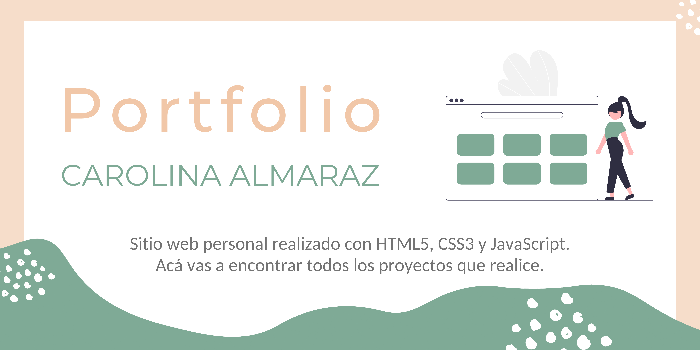

#  ✦ Proyecto: **Portfolio personal**

Este proyecto lo realicé siguiendo el modelo propuesto por AdaITW, academia en la que actualmente curso Desarrollo Web Front End. 

A demás de tener acceso a todos los proyectos que hago, vas a encontrar los lenguajes con los cuales trabajo y también los medios para ponernos en contacto.

## Website
[Click aquí para ver portfolio](https://caroalmaraz.netlify.app/)
____________________________________________________________________________

## Funcionalidad
* **Sitio web personal**
* **Diseño responsivo:**
    + Smartphone
    + Tablet

## Realizado con:
* HTML5
* CSS3
* GIT
* JAVASCRIPT
* Deploy en NETLIFY

## Recursos:
* Fuente: Montserrat - https://fonts.google.com/
* Imágenes: https://undraw.co/illustrations
* Íconos: https://fontawesome.com/
* Colores: 7FAA96, F1C7A8, 5C555F, BLACK, WHITE.